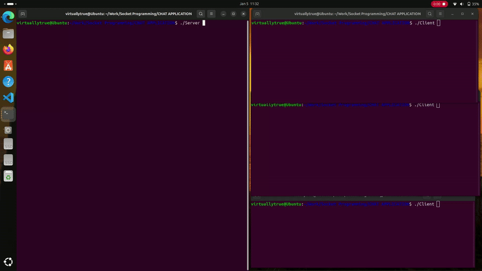

# Multi-Client Chat Server

This project implements a multi-client chat server using C with POSIX socket programming and multithreading. The server allows multiple clients to connect, communicate with each other, and ensures a smooth chat experience.

## Features

- Dynamic assignment of an IP address and port for the server.
- Configurable maximum number of client connections.
- Server broadcasts messages to all connected clients except the sender.
- Clients can join the server using a username.
- Graceful shutdown for the server and connected clients.

## Requirements

- A Linux-based operating system.
- GCC compiler.
- Basic understanding of sockets and multithreading in C.

## Installation

1. Clone the repository:
   ```bash
   git clone https://github.com/your-username/multi-client-chat-server.git
   cd multi-client-chat-server
   ```

2. Compile the code:
   ```bash
   gcc -pthread server.c -o server
   gcc -pthread client.c -o client
   ```

## Usage

### Starting the Server
1. Run the server:
   ```bash
   ./server
   ```
2. The server will display the assigned IP address and port.
3. Enter the maximum number of clients allowed to join the chat.

### Connecting Clients
1. On a client machine, run:
   ```bash
   ./client
   ```
2. Enter the server's IP address and port number.
3. Provide a username to join the chat.

### Chat Commands
- **BYE**: Clients can type `BYE` to disconnect from the server.
- The server administrator can type `BYE` to shut down the server and notify all connected clients.

## Example

1. **Server Output:**
   ```
   The server is running on IP Address: 192.168.1.100
   Selected Port Number: 23456
   Enter the maximum number of people that can join the chat: 5
   ```

2. **Client Output:**
   ```
   Enter Server IP Address: 192.168.1.100
   Enter Server Port Number: 23456
   Enter your username: Alice
   Alice : Hello everyone!
   Bob : Hi Alice!
   ```

3. **Server Shutdown:**
   ```
   Initiating server shutdown...
   Server shut down successfully.
   ```

## Code Structure

- **server.c**: Handles server-side operations, including managing connections and broadcasting messages.
- **client.c**: Handles client-side operations, including reading and sending messages to the server.

## Future Enhancements

- Support for private messaging between clients.
- Add authentication for clients.
- Enhanced UI for better user experience.

## Demo


